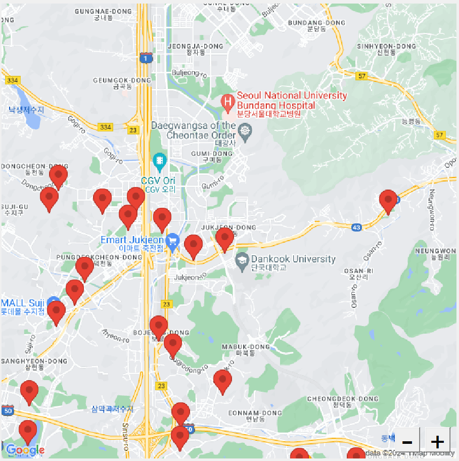
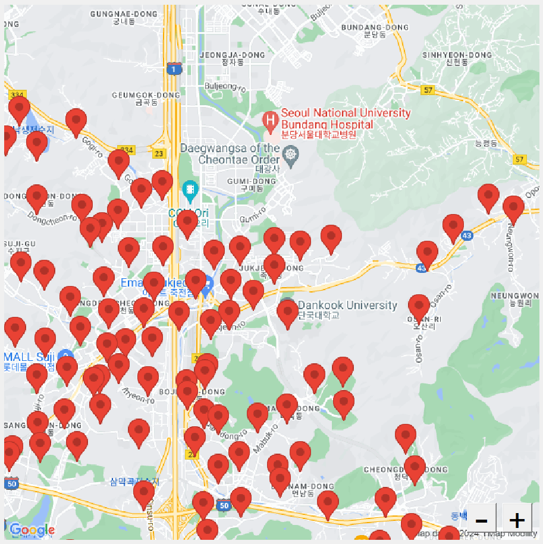

# 전기차 충전소 찾기 앱

## Progress
- [x] 그래프
- [x] 즐겨찾기
- [x] 검색기록
- [x] 지도
- [x] 상세정보
- [x] 이메일
- [x] 충전기 정보 표시
- [ ] 길찾기
- [ ] C/C++ 연동
- [ ] 텔레그램 봇


## 추가
- 길 알려주기: https://developers.google.com/maps/documentation/javascript/directions?hl=ko  
- https://console.cloud.google.com/apis/library/browse?filter=category:maps&project=scriptlangtermproject&supportedpurview=project

## 변경할거
모든 충전소 위치를 미리 로드하도록? -> 너무 오래걸릴듯  
같은 장소에 있는 충전소는 한개만 표시, 클릭시 상세정보에는 전부 표시  
선택한 충전기는 마커색 다르게 표시  
이미지 범위 밖의 마커는 링크를 넘기지 않음 -> 이거 어케함?? 그냥 거리순으로 하고, 너무 먼건 제거하는 식으로  
가까운 마커는 하나만 표시  


## Map memo
900x900 기준  

zoom == 13일때 가로로 보이는 거리가 1이라고 하면,  
zoom == 14일때는 1/2,  
zoom == 15일때는 1/4,  
zoom == 16일때는 1/8, ...

zoom == 12일때는 2,  
zoom == 11일때는 4,  
zoom == 10일때는 8, ...

zoom == 13일때 대략 ±0.055가 한계.

```py
    limit = 0.055 * (2 ** (13 - zoom))
```

**작동검증**  
마커 많이 찍을때(9999개 로드) 기본상태에서는 지도 로드 안되던거 줌 당기면 로드됨(죽전 기준)  


## Marker Grouping
https://developers.google.com/maps/documentation/javascript/marker-clustering?hl=ko  
어쨌든 마커를 넘겨줘야할거기 때문에 이건 못쓸거같다.  

0. 보이는 지점의 마커만 가지고 수행
1. 아무 점 하나 잡기
2. 합칠 범위 설정(배율에 따라 다름)
3. 범위 안의 점들의 중심을 마커로 설정
4. 합쳐지지 않은 다른 점들로 다시 수행

```py
radius = (0.055 * (2 ** (13 - zoom))) / 2
```
일때  


```py
radius = (0.055 * (2 ** (13 - zoom))) / 10
```
일때  


